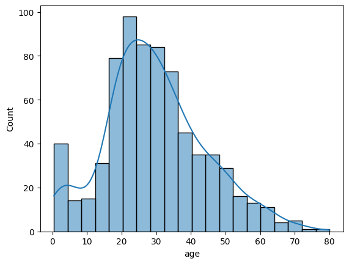
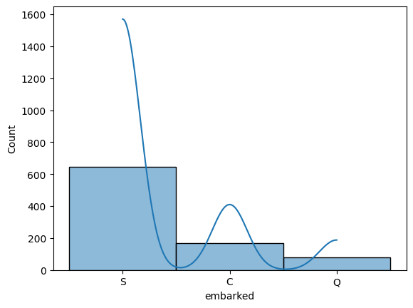

# 🚢 Titanic Survival Prediction: Missing Values & Feature Engineering

<div align="center">

[](https://www.python.org/)
[](https://scikit-learn.org/)
[](https://pandas.pydata.org/)
[](https://jupyter.org/)
[](LICENSE)

**A comprehensive machine learning project demonstrating production-ready data preprocessing pipelines with scikit-learn**

[Key Features](#-key-features) •
[Quick Start](#-quick-start) •
[Methodology](#-methodology) •
[Results](#-results) •
[Contributing](#-contributing)

</div>

---

## 📖 Overview

This project demonstrates a **complete end-to-end machine learning pipeline** for predicting passenger survival on the Titanic using the famous dataset. The focus is on building **robust, reusable preprocessing pipelines** that handle missing values and feature transformations professionally.

### 🎯 What You'll Learn

- ✅ **Missing Value Detection** — Identify and analyze patterns in incomplete data
- ✅ **Imputation Strategies** — Apply median, mode, and custom imputation techniques
- ✅ **Feature Engineering** — Transform raw features into ML-ready representations
- ✅ **Pipeline Architecture** — Build modular, production-ready sklearn pipelines
- ✅ **Data Leakage Prevention** — Implement proper train/test splitting strategies
- ✅ **Model Evaluation** — Assess classifier performance with comprehensive metrics

---

## 📊 Dataset

The **Titanic Dataset** contains information about 891 passengers from the RMS Titanic. The goal is to predict whether a passenger survived the sinking based on various features.

### Feature Descriptions

| Feature | Type | Description | Missing Values |
|:--------|:-----|:------------|:--------------:|
| `pclass` | Categorical | Passenger class (1st, 2nd, 3rd) | 0 |
| `sex` | Categorical | Gender (male/female) | 0 |
| `age` | Numerical | Age in years | **177** |
| `sibsp` | Numerical | # of siblings/spouses aboard | 0 |
| `parch` | Numerical | # of parents/children aboard | 0 |
| `fare` | Numerical | Ticket price (British Pounds) | 0 |
| `embarked` | Categorical | Port of embarkation (C/Q/S) | **2** |
| `survived` | Binary | Target variable (0 = No, 1 = Yes) | 0 |

### 📈 Data Visualizations

<table>
<tr>
<td align="center"><b>Age Distribution</b></td>
<td align="center"><b>Embarked Distribution</b></td>
</tr>
<tr>
<td></td>
<td></td>
</tr>
</table>

---

## 🔧 Methodology

### Pipeline Architecture

```
┌─────────────────────────────────────────────────────────────┐
│                    PREPROCESSING PIPELINE                    │
├─────────────────────────────────────────────────────────────┤
│                                                             │
│  ┌─────────────────┐         ┌─────────────────┐           │
│  │  NUMERICAL      │         │  CATEGORICAL    │           │
│  │  FEATURES       │         │  FEATURES       │           │
│  │                 │         │                 │           │
│  │  • age          │         │  • pclass       │           │
│  │  • sibsp        │         │  • sex          │           │
│  │  • parch        │         │  • embarked     │           │
│  │  • fare         │         │                 │           │
│  │                 │         │                 │           │
│  │  ┌───────────┐  │         │  ┌───────────┐  │           │
│  │  │ Imputer   │  │         │  │ Imputer   │  │           │
│  │  │ (median)  │  │         │  │ (mode)    │  │           │
│  │  └─────┬─────┘  │         │  └─────┬─────┘  │           │
│  │        │        │         │        │        │           │
│  │  ┌─────▼─────┐  │         │  ┌─────▼─────┐  │           │
│  │  │ Standard  │  │         │  │ OneHot    │  │           │
│  │  │ Scaler    │  │         │  │ Encoder   │  │           │
│  │  └───────────┘  │         │  └───────────┘  │           │
│  └────────┬────────┘         └────────┬────────┘           │
│           │                           │                     │
│           └───────────┬───────────────┘                     │
│                       │                                     │
│              ┌────────▼────────┐                           │
│              │ ColumnTransformer│                           │
│              └────────┬────────┘                           │
│                       │                                     │
├───────────────────────┼─────────────────────────────────────┤
│              ┌────────▼────────┐                           │
│              │   Logistic      │                           │
│              │   Regression    │                           │
│              └─────────────────┘                           │
│                    MODEL                                    │
└─────────────────────────────────────────────────────────────┘
```

### Key Implementation Details

#### 1. Numerical Feature Pipeline
```python
numerical_pipeline = Pipeline([
    ('imputer', SimpleImputer(strategy='median')),  # Robust to outliers
    ('scaler', StandardScaler())                    # Zero mean, unit variance
])
```

#### 2. Categorical Feature Pipeline
```python
categorical_pipeline = Pipeline([
    ('imputer', SimpleImputer(strategy='most_frequent')),  # Mode imputation
    ('encoder', OneHotEncoder(handle_unknown='ignore'))     # Sparse encoding
])
```

#### 3. Combined Preprocessor
```python
preprocessor = ColumnTransformer([
    ('num', numerical_pipeline, numerical_features),
    ('cat', categorical_pipeline, categorical_features)
])
```

#### 4. Full ML Pipeline
```python
model = Pipeline([
    ('preprocessor', preprocessor),
    ('classifier', LogisticRegression(max_iter=100000))
])
```

---

## 📈 Results

### Model Performance

| Metric | Score |
|:-------|:-----:|
| **Accuracy** | 79.4% |
| **Precision (Survived)** | 77% |
| **Recall (Survived)** | 70% |
| **F1-Score (Survived)** | 73% |

### Classification Report

```
              precision    recall  f1-score   support

           0       0.81      0.86      0.83       133
           1       0.77      0.70      0.73        90

    accuracy                           0.79       223
   macro avg       0.79      0.78      0.78       223
weighted avg       0.79      0.79      0.79       223
```

---

## 🚀 Quick Start

### Prerequisites
- Python 3.8+
- pip package manager

### Installation

```bash
# Clone the repository
git clone https://github.com/yourusername/featureEngineering.git
cd featureEngineering

# Create virtual environment (recommended)
python -m venv .venv
source .venv/bin/activate  # On Windows: .venv\Scripts\activate

# Install dependencies
pip install pandas scikit-learn seaborn matplotlib numpy jupyter
```

### Run the Notebook

```bash
jupyter notebook missing_values.ipynb
```

---

## 📁 Project Structure

```
featureEngineering/
├── 📓 missing_values.ipynb    # Main notebook with complete analysis
├── 📖 README.md               # Project documentation
├── 📊 age_plot.png            # Age distribution visualization
├── 📊 embarked_plot.png       # Embarked distribution visualization
├── 📁 .venv/                  # Virtual environment (not tracked)
└── 📁 .vscode/                # VS Code settings
```

---

## 🛠️ Technologies Used

| Technology | Purpose |
|:-----------|:--------|
| 🐼 **Pandas** | Data manipulation and analysis |
| 📊 **Seaborn** | Statistical data visualization |
| 🤖 **Scikit-learn** | ML algorithms and preprocessing |
| 📈 **Matplotlib** | Plotting and visualization |
| 🔢 **NumPy** | Numerical computations |

---

## 🎓 Learning Outcomes

By studying this project, you will learn:

| Topic | Description |
|:------|:------------|
| **Missing Data Handling** | Strategies for imputing incomplete datasets |
| **Pipeline Architecture** | Building modular, reusable preprocessing workflows |
| **Data Leakage Prevention** | Proper train/test splitting to avoid bias |
| **Feature Engineering** | Transforming raw data for ML consumption |
| **Model Evaluation** | Comprehensive metrics for classification tasks |
| **Code Organization** | Clean, documented, production-ready code |

---

## 🤝 Contributing

Contributions are welcome! Please feel free to submit a Pull Request.

1. Fork the repository
2. Create your feature branch (`git checkout -b feature/AmazingFeature`)
3. Commit your changes (`git commit -m 'Add some AmazingFeature'`)
4. Push to the branch (`git push origin feature/AmazingFeature`)
5. Open a Pull Request

---

## 👤 Author

**Ahmed Essam**  
*Machine Learning & Data Science Enthusiast*

[](https://github.com/ahmedessammdev)
[](https://linkedin.com/in/yourprofile)

---

## 📄 License

This project is licensed under the MIT License - see the [LICENSE](LICENSE) file for details.

---

<div align="center">

### ⭐ If you found this project helpful, please give it a star!

**Made with ❤️ by Ahmed Essam**

</div>
